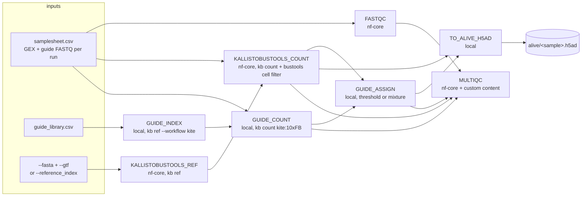

# jam-sudo/ngspipeline

[](https://github.com/jam-sudo/ngspipeline/actions/workflows/nf-test.yml)
[](https://github.com/jam-sudo/ngspipeline/actions/workflows/linting.yml)[](https://doi.org/10.5281/zenodo.XXXXXXX)
[](https://www.nf-test.com)

[](https://www.nextflow.io/)
[](https://github.com/nf-core/tools/releases/tag/4.1.0)
[](https://docs.conda.io/en/latest/)
[](https://www.docker.com/)
[](https://sylabs.io/docs/)
[](https://cloud.seqera.io/launch?pipeline=https://github.com/jam-sudo/ngspipeline)

## Introduction

**Status: in development** (v0.1.0dev). Nothing in this README is a claim of completion until the corresponding row in [`docs/progress.md`](docs/progress.md) is marked done with evidence.

**jam-sudo/ngspipeline** turns raw Perturb-seq reads into an analysis-ready dataset for [ALIVE](https://github.com/jam-sudo/alive): FASTQ → gene-expression (GEX) and sgRNA count matrices → per-cell guide assignment → an ALIVE-ready `.h5ad`. It is a Nextflow DSL2 pipeline built on the nf-core template and nf-core modules; the four steps that have no nf-core module are hand-written local modules.



1. Read QC of both libraries ([`FastQC`](https://www.bioinformatics.babraham.ac.uk/projects/fastqc/)).
2. GEX quantification with [kallisto|bustools](https://www.kallistobus.tools/) (`kb ref` on `--fasta`/`--gtf`, or a prebuilt `--reference_index`; `kb count --filter bustools` for empty-droplet removal). Native kb output is kept as-is ([decision 002](docs/decisions/002-quantifier.md)).
3. Guide counting with the kb **kite** workflow: protospacers indexed with Hamming-1 variants, `kite:10xFB` translates the 10x 3' v3 feature-barcode variant to the GEX barcode ([005](docs/decisions/005-guide-count-method.md)).
4. Per-cell guide (vector) assignment, `--assign_method threshold` or `mixture` (Poisson/Gaussian on log2 UMI, Replogle et al.), with every evidence column in `assignment.tsv`.
5. `alive/<sample>.h5ad`: raw counts + assignment; non-single cells excluded by default ([006](docs/decisions/006-nonsingle-cells.md), schema in [`docs/alive_schema.md`](docs/alive_schema.md)).
6. One [MultiQC](https://multiqc.info/) report with FastQC, quantification statistics and the guide-assignment section.

## Usage

> [!NOTE]
> If you are new to Nextflow and nf-core, please refer to [this page](https://nf-co.re/docs/get_started/environment_setup) on how to set-up Nextflow. Make sure to [test your setup](https://nf-co.re/docs/get_started/introduction#check-your-nextflow-installation) with `-profile test` before running the workflow on actual data.

### Inputs

`samplesheet.csv` — one row per sequencing run; rows with the same `sample_id` are merged (GEX pairs from every row, guide pairs from the rows that carry them). Relative paths are resolved against the samplesheet's directory.

```csv
sample_id,gex_r1,gex_r2,guide_r1,guide_r2,expected_cells
sampleA,run1_gex_R1.fastq.gz,run1_gex_R2.fastq.gz,run1_guide_R1.fastq.gz,run1_guide_R2.fastq.gz,3681
sampleA,run2_gex_R1.fastq.gz,run2_gex_R2.fastq.gz,,,3681
```

`guide_library.csv` — one row per sgRNA: `guide_id,target_gene,protospacer[,vector_id]`. `vector_id` groups the sgRNAs of one vector (dual-guide libraries); non-targeting controls have `target_gene` = `non-targeting`.

Reference: `--fasta` + `--gtf` (the pipeline builds the kb index) or `--reference_index <dir>` containing `*.idx` and `t2g.txt` (see `bin/build_reference_index.sh` and [002](docs/decisions/002-quantifier.md) for why a prebuilt index is used for the full human reference on small machines).

`--chemistry` (`10XV2` | `10XV3`) selects the 10x whitelist and read layout and must be set from the dataset's protocol ([001](docs/decisions/001-dataset.md)). `--min_umi` and `--min_ratio` have no defaults; pass them with `-params-file` (see the note below).

### Run

```bash
nextflow run jam-sudo/ngspipeline -profile <docker/singularity/...>,local \
   --input samplesheet.csv --guides guide_library.csv \
   --reference_index /path/to/kb_index --chemistry 10XV3 \
   -params-file assign_params.yml \
   --outdir <OUTDIR>
```

`assign_params.yml`:

```yaml
assign_method: threshold
min_umi: 5
min_ratio: 3
```

> [!NOTE]
> `--min_ratio 3` on the command line is currently rejected by the parameter validation (parsed as a string on this parameter name); a params file works.

> [!WARNING]
> Please provide pipeline parameters via the CLI or Nextflow `-params-file` option. Custom config files including those provided by the `-c` Nextflow option can be used to provide any configuration _**except for parameters**_; see [docs](https://nf-co.re/docs/usage/getting_started/configuration#custom-configuration-files).

Test profile (18 MB subsample of a real Perturb-seq sample, see [`assets/test_data/README.md`](assets/test_data/README.md) and [008](docs/decisions/008-test-data-design.md)):

```bash
nextflow run . -profile test,docker --outdir results
```

### Outputs (`--outdir`)

```
counts/<sample>/                      kb count native output (counts_unfiltered/, counts_filtered/, *.bus, run_info.json, ...)
guides/<sample>/guide_counts.h5ad     cells x guides (all barcodes; kite)
guides/<sample>/assignment.tsv        cell_barcode, guide_id, target_gene, method, top1_umi, top2_umi, ratio, posterior, status{single,multi,unassigned}, ...
guides/<sample>/assignment_summary.tsv
alive/<sample>.h5ad                   counts + assignment (obs: cell_barcode, gene, guide_id, target_gene, assignment_status, assignment_confidence, assignment_method, ...)
reference/{kb_index,guide_index}/     indices built in-pipeline
multiqc/multiqc_report.html
pipeline_info/{execution_report,execution_timeline,execution_trace,pipeline_dag}
```

## Development

- Tasks, Definitions of Done and evidence: [`PLAN.md`](PLAN.md), [`docs/progress.md`](docs/progress.md).
- Decision records (dataset, quantifier, dev host, naming, guide counting, non-single cells, test data): [`docs/decisions/`](docs/decisions/README.md).
- Validation against the authors' guide identities: [`docs/01_guide_assignment_validation.md`](docs/01_guide_assignment_validation.md).
- Unit tests: `nf-test test .` (module tests under `modules/local/*/tests`, pipeline test in `tests/`).

## Credits

jam-sudo/ngspipeline was written by Jae Min Yoon with Claude Code as the implementing agent; every task is reviewed and its Definition of Done executed by the human ([`CLAUDE.md`](CLAUDE.md)).

## Citations

Data used for testing and validation: Replogle et al. 2022, _Cell_ 185(14):2559–2575, [doi:10.1016/j.cell.2022.05.013](https://doi.org/10.1016/j.cell.2022.05.013) (SRA PRJNA831566; processed data CC BY 4.0).

An extensive list of references for the tools used by the pipeline can be found in the [`CITATIONS.md`](CITATIONS.md) file.

This pipeline uses code and infrastructure developed and maintained by the [nf-core](https://nf-co.re) community, reused here under the [MIT license](https://github.com/nf-core/tools/blob/main/LICENSE).

> **The nf-core framework for community-curated bioinformatics pipelines.**
>
> Philip Ewels, Alexander Peltzer, Sven Fillinger, Harshil Patel, Johannes Alneberg, Andreas Wilm, Matthias Ulysse Garcia, Paolo Di Tommaso & Sven Nahnsen.
>
> _Nat Biotechnol._ 2020 Feb 13. doi: [10.1038/s41587-020-0439-x](https://dx.doi.org/10.1038/s41587-020-0439-x).
