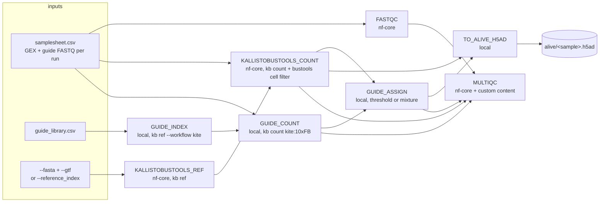

# jam-sudo/ngspipeline

[](https://github.com/jam-sudo/ngspipeline/actions/workflows/nf-test.yml)
[](https://github.com/jam-sudo/ngspipeline/actions/workflows/linting.yml)[](https://www.nf-test.com)

[](https://www.nextflow.io/)
[](https://github.com/nf-core/tools/releases/tag/4.1.0)
[](https://docs.conda.io/en/latest/)
[](https://www.docker.com/)
[](https://sylabs.io/docs/)
[](https://cloud.seqera.io/launch?pipeline=https://github.com/jam-sudo/ngspipeline)

## Introduction

**Latest release: tag [`1.0.1`](https://github.com/jam-sudo/ngspipeline/releases/tag/1.0.1)** (run it with `-r 1.0.1`); development continues on `dev`.

**jam-sudo/ngspipeline** turns raw Perturb-seq reads into an analysis-ready dataset for [ALIVE](https://github.com/jam-sudo/alive): FASTQ → gene-expression (GEX) and sgRNA count matrices → per-cell guide assignment → an ALIVE-ready `.h5ad`. It is a Nextflow DSL2 pipeline built on the nf-core template and nf-core modules; the four steps that have no nf-core module are hand-written local modules.


```mermaid
flowchart LR
    subgraph inputs
        SS[samplesheet.csv<br/>GEX + guide FASTQ per run]
        GL[guide_library.csv]
        REF[--fasta + --gtf<br/>or --reference_index]
    end
    SS --> FQ[FASTQC<br/>nf-core]
    REF --> KBR[KALLISTOBUSTOOLS_REF<br/>nf-core, kb ref]
    KBR --> KBC[KALLISTOBUSTOOLS_COUNT<br/>nf-core, kb count + bustools cell filter]
    SS --> KBC
    GL --> GI[GUIDE_INDEX<br/>local, kb ref --workflow kite]
    GI --> GC[GUIDE_COUNT<br/>local, kb count kite:10xFB]
    SS --> GC
    KBC --> GA[GUIDE_ASSIGN<br/>local, threshold or mixture]
    GC --> GA
    KBC --> H5[TO_ALIVE_H5AD<br/>local]
    GA --> H5
    FQ --> MQ[MULTIQC<br/>nf-core + custom content]
    KBC --> MQ
    GC --> MQ
    GA --> MQ
    H5 --> OUT[(alive/&lt;sample&gt;.h5ad)]
```

1. Read QC of both libraries ([`FastQC`](https://www.bioinformatics.babraham.ac.uk/projects/fastqc/)).
2. GEX quantification with [kallisto|bustools](https://www.kallistobus.tools/) (`kb ref` on `--fasta`/`--gtf`, or a prebuilt `--reference_index`; `kb count --filter bustools` for empty-droplet removal). Native kb output is kept as-is.
3. Guide counting with the kb **kite** workflow: protospacers indexed with Hamming-1 variants, `kite:10xFB` translates the 10x 3' v3 feature-barcode variant to the GEX barcode.
4. Per-cell guide (vector) assignment, `--assign_method threshold` or `mixture` (Poisson/Gaussian on log2 UMI, Replogle et al.), with every evidence column in `assignment.tsv`.
5. `alive/<sample>.h5ad`: raw counts + assignment; non-single cells excluded by default (schema in [`docs/alive_schema.md`](docs/alive_schema.md)).
6. One [MultiQC](https://multiqc.info/) report with FastQC, quantification statistics and the guide-assignment section.

## Usage

### Setup and first run

Use Nextflow **25.10.4 or newer** and a working Docker or Singularity runtime. The bundled test profile caps each task at 4 CPUs and 10 GB RAM. GEX and guide counting can run concurrently, so allow memory for both tasks. For the development MacBook E2E run, use Colima with 8 CPUs, 20 GB RAM and Rosetta:

```bash
colima start --cpu 8 --memory 20 --vz-rosetta
docker info
```

Run the released pipeline on the bundled real-read test data before using your own inputs:

```bash
NXF_VER=25.10.4 nextflow run jam-sudo/ngspipeline -r 1.0.1 \
  -profile test,docker --outdir results/test
```

On Apple Silicon, add `emulate_amd64` to the profiles (`test,docker,emulate_amd64`) to explicitly select the amd64 containers. For a local checkout, replace `jam-sudo/ngspipeline -r 1.0.1` with `.`; this runs the checked-out code, including development changes. Keep the work directory under your home directory when using Colima so containers can access it.

### Inputs

`samplesheet.csv` — one row per sequencing run; rows with the same `sample_id` are merged (GEX pairs from every row, guide pairs from the rows that carry them). Relative paths are resolved against the samplesheet's directory.

```csv
sample_id,gex_r1,gex_r2,guide_r1,guide_r2,expected_cells
sampleA,run1_gex_R1.fastq.gz,run1_gex_R2.fastq.gz,run1_guide_R1.fastq.gz,run1_guide_R2.fastq.gz,3681
sampleA,run2_gex_R1.fastq.gz,run2_gex_R2.fastq.gz,,,3681
```

`guide_library.csv` — one row per sgRNA: `guide_id,target_gene,protospacer[,vector_id]`. `vector_id` groups the sgRNAs of one vector (dual-guide libraries); non-targeting controls have `target_gene` = `non-targeting`.

Every sample needs paired GEX reads and at least one guide-read pair across its rows. Supply both guide paths together or leave both blank. `expected_cells` must be a positive integer and agree across rows of the same sample. FASTQ paths and sample IDs cannot contain spaces. Example inputs: [`assets/samplesheet_test.csv`](assets/samplesheet_test.csv), [`assets/guide_library_test.csv`](assets/guide_library_test.csv).

Reference: `--fasta` + `--gtf` (the pipeline builds the kb index) or `--reference_index <dir>` containing `*.idx` and `t2g.txt` (build a prebuilt cDNA index with `bin/build_reference_index.sh`; use it for the full human reference on small machines).

`--chemistry` (`10XV2` | `10XV3`) selects the 10x whitelist and read layout and must be set from the dataset's protocol. `--min_umi` defaults to 10 and `--min_ratio` to 3; override them with `-params-file` (see the note below).

### Run

```bash
NXF_VER=25.10.4 nextflow run jam-sudo/ngspipeline -r 1.0.1 -profile docker,local \
   --input samplesheet.csv --guides guide_library.csv \
   --reference_index /path/to/kb_index --chemistry 10XV3 \
   -params-file assign_params.yml \
   --outdir <OUTDIR>
```

`assign_params.yml` (only needed to override the defaults):

```yaml
assign_method: threshold
min_umi: 10
min_ratio: 3
```

> [!NOTE]
> Numeric and boolean parameters given as `--name value` on the command line (`--min_ratio 3`, `--pool_alive true`) are rejected by the parameter validation (parsed as strings); put them in a `-params-file` (`pool_alive: true`) or, for booleans, pass the bare flag `--pool_alive`.

> [!WARNING]
> Please provide pipeline parameters via the CLI or Nextflow `-params-file` option. Custom config files including those provided by the `-c` Nextflow option can be used to provide any configuration _**except for parameters**_; see [docs](https://nf-co.re/docs/usage/getting_started/configuration#custom-configuration-files).

Test profile (18 MB subsample of a real Perturb-seq sample, see [`assets/test_data/README.md`](assets/test_data/README.md)). From the repository root:

```bash
NXF_VER=25.10.4 nextflow run . -profile test,docker --outdir results/test
```

This executes FASTQ QC, both reference builds, GEX and guide counting, guide assignment, h5ad export and MultiQC. The test profile uses `min_umi: 5`, `min_ratio: 3`; production defaults are `min_umi: 10`, `min_ratio: 3`. Add `-resume` when restarting an interrupted run with the same work directory.

### Outputs (`--outdir`)

```
fastqc/                              read QC reports for both libraries
counts/<sample>/                      kb count native output (counts_unfiltered/, counts_filtered/, *.bus, run_info.json, ...)
guides/<sample>/guide_counts.h5ad     cells x guides (all barcodes; kite)
guides/<sample>/assignment.tsv        cell_barcode, guide_id, target_gene, method, top1_umi, top2_umi, ratio, posterior, status{single,multi,unassigned}, ...
guides/<sample>/assignment_summary.tsv
alive/<sample>.h5ad                   counts + assignment (obs: cell_barcode, gene, guide_id, target_gene, assignment_status, assignment_confidence, assignment_method, ...)
alive/pooled.h5ad                     with --pool_alive and > 1 sample: all samples, obs index <barcode>-<sample_id>
alive/<id>.alive_summary.json         cells, labels, status counts per h5ad
reference/{kb_index,guide_index}/     indices built in-pipeline
multiqc/multiqc_report.html
pipeline_info/{execution_report,execution_timeline,execution_trace,pipeline_dag}
```

## Run statistics

Sample: Replogle 2022 K562 essential-scale, GEM group `lane_4` (235 M GEX read pairs, 19.7 M guide read pairs), prebuilt cDNA index, `--assign_method threshold`.

| profile                                        | host                                                | wall time                                                            | peak memory (process)                                   | notes                                               |
| ---------------------------------------------- | --------------------------------------------------- | -------------------------------------------------------------------- | ------------------------------------------------------- | --------------------------------------------------- |
| `local,docker`                                 | MacBook M5 Pro 24 GB, Colima 8 CPU / 20 GB, Rosetta | 2 h 23 min (≈ 50 min without an operator-interrupted FastQC attempt) | 15.9 GB (KALLISTOBUSTOOLS_COUNT)                        | Full lane_4                                         |
| `test,singularity`                             | Colima VM, Apptainer 1.5.3, aarch64 + Rosetta       | 2 min 35 s (Docker: 1 min 33 s)                                      | 8.8 GB (GUIDE_COUNT)                                    | Identical h5ad across test profiles                 |
| `slurm,singularity`                            | NEU Discovery, `sharing`, 28-core / 186 GB node     | 28 min 9 s                                                           | 35.7 GB (KALLISTOBUSTOOLS_COUNT)                        | Full lane_4; h5ad identical to local                |
| `awsbatch,docker`                              | Not executed                                        | —                                                                    | —                                                       | Profile available; untested on AWS                  |
| `slurm,singularity`, 12 lanes + `--pool_alive` | NEU Discovery `sharing`, 12 samples in parallel     | 1 h 52 min                                                           | 36.2 GB (KALLISTOBUSTOOLS_COUNT), 10.1 GB (pooled h5ad) | 104,551 pooled cells; ALIVE prepare + fit completed |

## Development

### End-to-end validation

From the repository root, run the existing pipeline test with nf-test (CI pins nf-test 0.9.4). Use a fresh `NFT_WORKDIR` for a new execution; `--ci` prevents creating missing snapshots silently:

```bash
NXF_VER=25.10.4 NFT_WORKDIR=testing/e2e/nf-test \
  nf-test test tests/default.nf.test --profile test,docker --ci
```

On Apple Silicon use `--profile test,docker,emulate_amd64`. The test requires workflow success, 96–120 filtered GEX cells, 200 genes, 108 guide features, guide and ALIVE h5ad outputs, and matching snapshots of stable output paths and contents. It covers the single-sample threshold-assignment path with an in-pipeline reference build; pooled export and other assignment modes are covered separately by the local module tests.

Validate the final ALIVE schema using the existing checker (requires the Python environment with `anndata`, `numpy` and `scipy`):

```bash
python bin/check_alive_schema.py results/test/alive/replogle_k562_lane4_test.h5ad
```

Run all repository-owned tests, including the pipeline and local module tests:

```bash
NXF_VER=25.10.4 nf-test test . --profile test,docker --ci
```

Module tests live under `modules/local/*/tests`; the end-to-end pipeline test lives in `tests/`.

## Credits

jam-sudo/ngspipeline was written by Jae Min Yoon.

## Citations

Data used for testing and validation: Replogle et al. 2022, _Cell_ 185(14):2559–2575, [doi:10.1016/j.cell.2022.05.013](https://doi.org/10.1016/j.cell.2022.05.013) (SRA PRJNA831566; processed data CC BY 4.0).

An extensive list of references for the tools used by the pipeline can be found in the [`CITATIONS.md`](CITATIONS.md) file.

This pipeline uses code and infrastructure developed and maintained by the [nf-core](https://nf-co.re) community, reused here under the [MIT license](https://github.com/nf-core/tools/blob/main/LICENSE).

> **The nf-core framework for community-curated bioinformatics pipelines.**
>
> Philip Ewels, Alexander Peltzer, Sven Fillinger, Harshil Patel, Johannes Alneberg, Andreas Wilm, Matthias Ulysse Garcia, Paolo Di Tommaso & Sven Nahnsen.
>
> _Nat Biotechnol._ 2020 Feb 13. doi: [10.1038/s41587-020-0439-x](https://dx.doi.org/10.1038/s41587-020-0439-x).
